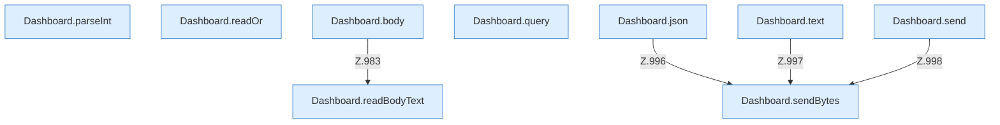

[[00 Start]] › [[Dashboard-HTTP]] › [[API-Antworten]]

# API-Antworten

```mermaid
flowchart TD
  n1["Dashboard.parseInt"]:::internal-link
  n2["Dashboard.readOr"]:::internal-link
  n3["Dashboard.readBodyText"]:::internal-link
  n4["Dashboard.body"]:::internal-link
  n5["Dashboard.query"]:::internal-link
  n6["Dashboard.json"]:::internal-link
  n7["Dashboard.text"]:::internal-link
  n8["Dashboard.send"]:::internal-link
  n9["Dashboard.sendBytes"]:::internal-link
  n4 -->|"Z.983"| n3
  n6 -->|"Z.996"| n9
  n7 -->|"Z.997"| n9
  n8 -->|"Z.998"| n9
  classDef internal-link fill:#ddeeff,stroke:#4488cc
  classDef befund fill:#f88
```

