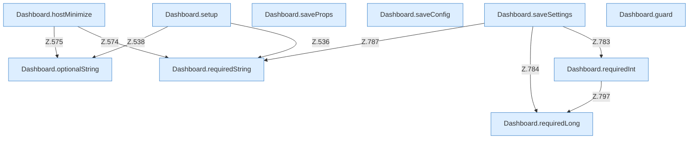

[[00 Start]] › [[Dashboard-HTTP]] › [[API-Setup]]

# API-Setup

```mermaid
flowchart TD
  n1["Dashboard.setup"]:::internal-link
  n2["Dashboard.hostMinimize"]:::internal-link
  n3["Dashboard.requiredString"]:::internal-link
  n4["Dashboard.optionalString"]:::internal-link
  n5["Dashboard.saveProps"]:::internal-link
  n6["Dashboard.saveConfig"]:::internal-link
  n7["Dashboard.saveSettings"]:::internal-link
  n8["Dashboard.requiredInt"]:::internal-link
  n9["Dashboard.requiredLong"]:::internal-link
  n10["Dashboard.guard"]:::internal-link
  n1 -->|"Z.536"| n3
  n1 -->|"Z.538"| n4
  n2 -->|"Z.574"| n3
  n2 -->|"Z.575"| n4
  n7 -->|"Z.783"| n8
  n7 -->|"Z.784"| n9
  n7 -->|"Z.787"| n3
  n8 -->|"Z.797"| n9
  classDef internal-link fill:#ddeeff,stroke:#4488cc
  classDef befund fill:#f88
```

