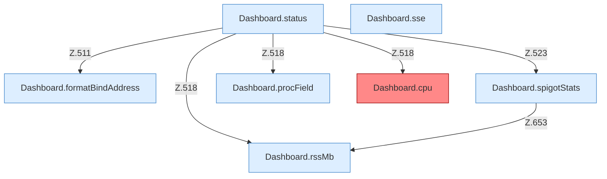

[[00 Start]] › [[Dashboard-HTTP]] › [[API-Status]]

# API-Status

```mermaid
flowchart TD
  n1["Dashboard.status"]:::internal-link
  n2["Dashboard.formatBindAddress"]:::internal-link
  n3["Dashboard.spigotStats"]:::internal-link
  n4["Dashboard.procField"]:::internal-link
  n5["Dashboard.cpu"]:::internal-link
  n6["Dashboard.rssMb"]:::internal-link
  n7["Dashboard.sse"]:::internal-link
  n1 -->|"Z.511"| n2
  n1 -->|"Z.518"| n5
  n1 -->|"Z.518"| n6
  n1 -->|"Z.518"| n4
  n1 -->|"Z.523"| n3
  n3 -->|"Z.653"| n6
  classDef internal-link fill:#ddeeff,stroke:#4488cc
  classDef befund fill:#f88
  style n5 fill:#f88,stroke:#900
```

