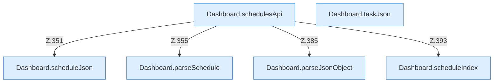

[[00 Start]] › [[Dashboard-HTTP]] › [[API-Zeit]]

# API-Zeit

```mermaid
flowchart TD
  n1["Dashboard.schedulesApi"]:::internal-link
  n2["Dashboard.parseSchedule"]:::internal-link
  n3["Dashboard.parseJsonObject"]:::internal-link
  n4["Dashboard.scheduleJson"]:::internal-link
  n5["Dashboard.scheduleIndex"]:::internal-link
  n6["Dashboard.taskJson"]:::internal-link
  n1 -->|"Z.351"| n4
  n1 -->|"Z.355"| n2
  n1 -->|"Z.385"| n3
  n1 -->|"Z.393"| n5
  classDef internal-link fill:#ddeeff,stroke:#4488cc
  classDef befund fill:#f88
```

