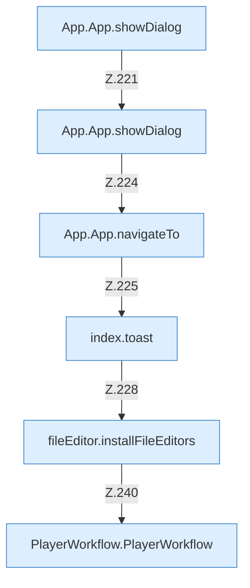

[[00 Start]] › [[Dashboard-UI]] › [[UI-App]] › [[App.App]] › [[App.App.Teil3.Calls219]]

# App.App.Teil3.Calls219

```mermaid
flowchart TD
  n1["App.App.showDialog"]:::internal-link
  n2["App.App.showDialog"]:::internal-link
  n3["App.App.navigateTo"]:::internal-link
  n4["index.toast"]:::internal-link
  n5["fileEditor.installFileEditors"]:::internal-link
  n6["PlayerWorkflow.PlayerWorkflow"]:::internal-link
  n1 -->|"Z.221"| n2
  n2 -->|"Z.224"| n3
  n3 -->|"Z.225"| n4
  n4 -->|"Z.228"| n5
  n5 -->|"Z.240"| n6
  classDef internal-link fill:#ddeeff,stroke:#4488cc
  classDef befund fill:#f88
```

- Fortsetzung von `App.App.Teil3`, Quellreihenfolge.
