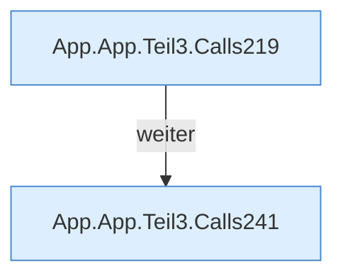

[[00 Start]] › [[Dashboard-UI]] › [[UI-App]] › [[App.App]] › [[App.App.Teil3]]

# App.App.Teil3

```mermaid
flowchart TD
  n1["App.App.Teil3.Calls219"]:::internal-link
  n2["App.App.Teil3.Calls241"]:::internal-link
  n1 -->|"weiter"| n2
  classDef internal-link fill:#ddeeff,stroke:#4488cc
  classDef befund fill:#f88
```

- Fortsetzung von `App.App`, Quellreihenfolge.
