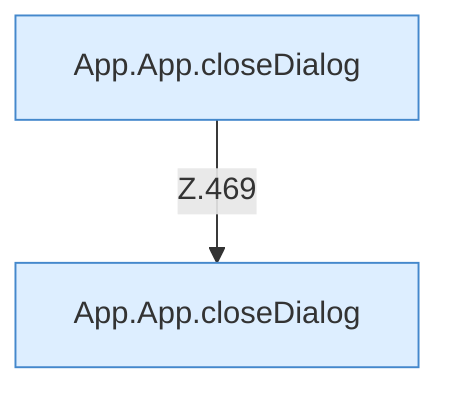

[[00 Start]] › [[Dashboard-UI]] › [[UI-App]] › [[App.App]] › [[App.App.Teil4.Calls443]]

# App.App.Teil4.Calls443

```mermaid
flowchart TD
  n1["App.App.closeDialog"]:::internal-link
  n2["App.App.closeDialog"]:::internal-link
  n1 -->|"Z.469"| n2
  classDef internal-link fill:#ddeeff,stroke:#4488cc
  classDef befund fill:#f88
```

- Fortsetzung von `App.App.Teil4`, Quellreihenfolge.
