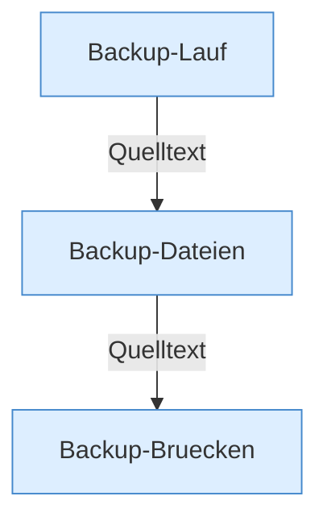

[[00 Start]] › [[Backup]]

# Backup

```mermaid
flowchart TD
  n1["Backup-Lauf"]:::internal-link
  n2["Backup-Dateien"]:::internal-link
  n3["Backup-Bruecken"]:::internal-link
  n1 -->|"Quelltext"| n2
  n2 -->|"Quelltext"| n3
  classDef internal-link fill:#ddeeff,stroke:#4488cc
  classDef befund fill:#f88
```

- Lokales Zip über `BackupBridge` oder FTP/FTPS über `RemoteBackupBridge`.
