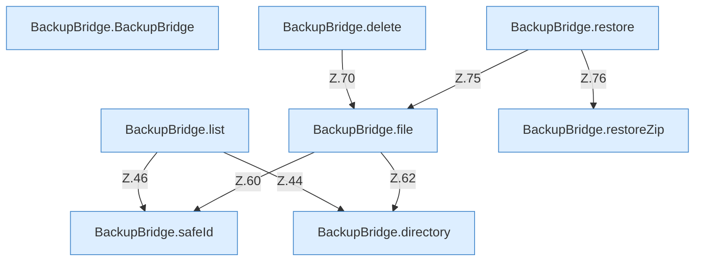

[[00 Start]] › [[Backup]] › [[Backup-Bruecken]] › [[BackupBridge]] › [[BackupBridge.Teil1]]

# BackupBridge.Teil1

```mermaid
flowchart TD
  n1["BackupBridge.BackupBridge"]:::internal-link
  n2["BackupBridge.list"]:::internal-link
  n3["BackupBridge.file"]:::internal-link
  n4["BackupBridge.delete"]:::internal-link
  n5["BackupBridge.restore"]:::internal-link
  n6["BackupBridge.restoreZip"]:::internal-link
  n7["BackupBridge.directory"]:::internal-link
  n8["BackupBridge.safeId"]:::internal-link
  n2 -->|"Z.44"| n7
  n2 -->|"Z.46"| n8
  n3 -->|"Z.60"| n8
  n3 -->|"Z.62"| n7
  n4 -->|"Z.70"| n3
  n5 -->|"Z.75"| n3
  n5 -->|"Z.76"| n6
  classDef internal-link fill:#ddeeff,stroke:#4488cc
  classDef befund fill:#f88
```

