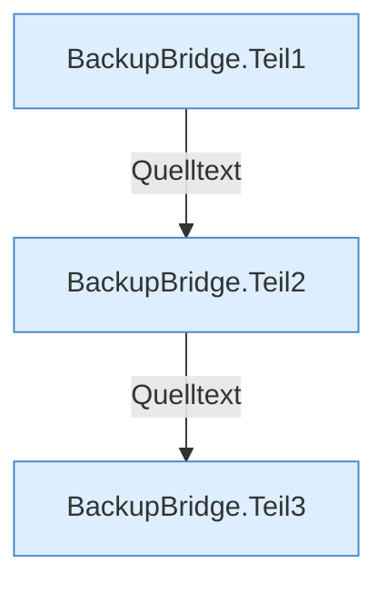

[[00 Start]] › [[Backup]] › [[Backup-Bruecken]] › [[BackupBridge]]

# BackupBridge

```mermaid
flowchart TD
  n1["BackupBridge.Teil1"]:::internal-link
  n2["BackupBridge.Teil2"]:::internal-link
  n3["BackupBridge.Teil3"]:::internal-link
  n1 -->|"Quelltext"| n2
  n2 -->|"Quelltext"| n3
  classDef internal-link fill:#ddeeff,stroke:#4488cc
  classDef befund fill:#f88
```

