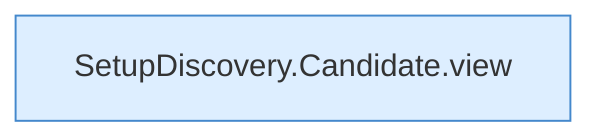

[[00 Start]] › [[Server-Anlage]] › [[Setup-Suche]] › [[SetupDiscovery]] › [[Candidate]]

# Candidate


```mermaid
flowchart TD
  n1["SetupDiscovery.Candidate.view"]:::internal-link
  classDef internal-link fill:#ddeeff,stroke:#4488cc
  classDef befund fill:#f88
```

```knoten
SetupDiscovery.Candidate.view
  Liefert die Sicht `view`.
```


