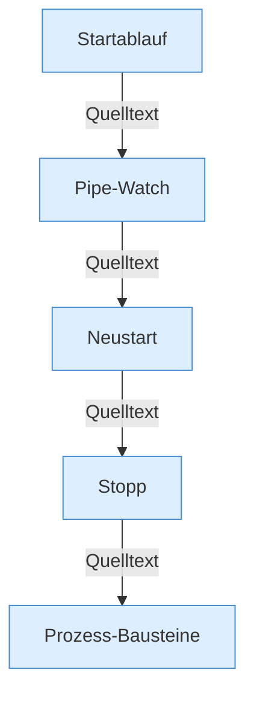
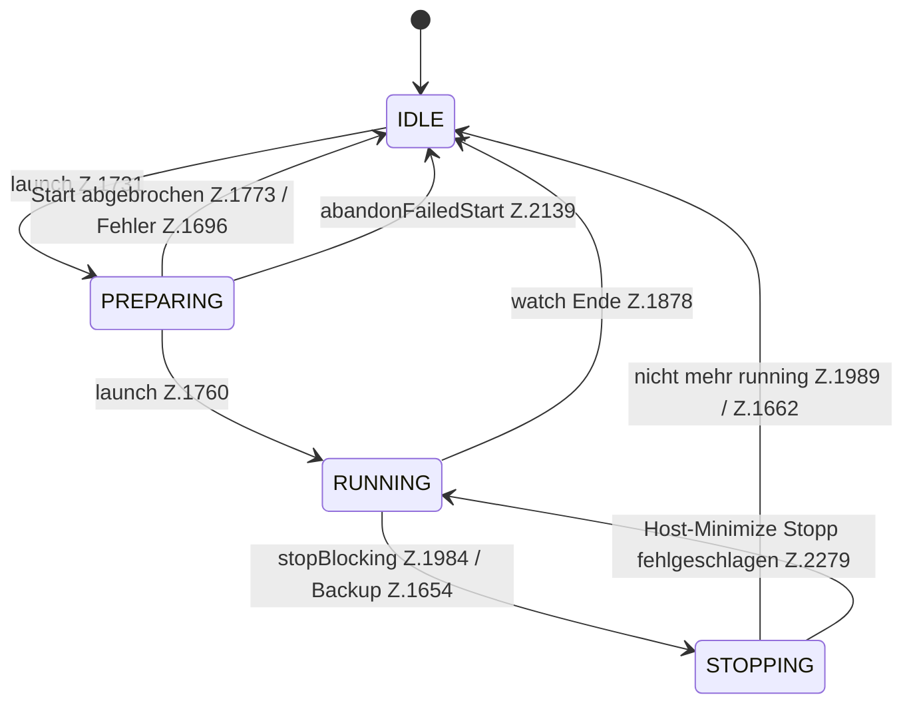

[[00 Start]] › [[Child-Prozess]]

# Child-Prozess

```mermaid
flowchart TD
  n1["Startablauf"]:::internal-link
  n2["Pipe-Watch"]:::internal-link
  n3["Neustart"]:::internal-link
  n4["Stopp"]:::internal-link
  n5["Prozess-Bausteine"]:::internal-link
  n1 -->|"Quelltext"| n2
  n2 -->|"Quelltext"| n3
  n3 -->|"Quelltext"| n4
  n4 -->|"Quelltext"| n5
  classDef internal-link fill:#ddeeff,stroke:#4488cc
  classDef befund fill:#f88
```

```mermaid
stateDiagram-v2
  [*] --> IDLE
  IDLE --> PREPARING: launch Z.1731
  PREPARING --> RUNNING: launch Z.1760
  PREPARING --> IDLE: Start abgebrochen Z.1773 / Fehler Z.1696
  RUNNING --> IDLE: watch Ende Z.1878
  PREPARING --> IDLE: abandonFailedStart Z.2139
  RUNNING --> STOPPING: stopBlocking Z.1984 / Backup Z.1654
  STOPPING --> IDLE: nicht mehr running Z.1989 / Z.1662
  STOPPING --> RUNNING: Host-Minimize Stopp fehlgeschlagen Z.2279
```

- Phase `IDLE`, `PREPARING`, `RUNNING`, `STOPPING` an `ChildSlot`.
