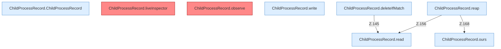

[[00 Start]] › [[Child-Prozess]] › [[Prozess-Bausteine]] › [[ChildProcessRecord]] › [[ChildProcessRecord.Teil1]]

# ChildProcessRecord.Teil1

```mermaid
flowchart TD
  n1["ChildProcessRecord.ChildProcessRecord"]:::internal-link
  n2["ChildProcessRecord.liveInspector"]:::internal-link
  n3["ChildProcessRecord.observe"]:::internal-link
  n4["ChildProcessRecord.ours"]:::internal-link
  n5["ChildProcessRecord.write"]:::internal-link
  n6["ChildProcessRecord.read"]:::internal-link
  n7["ChildProcessRecord.deleteIfMatch"]:::internal-link
  n8["ChildProcessRecord.reap"]:::internal-link
  n7 -->|"Z.145"| n6
  n8 -->|"Z.156"| n6
  n8 -->|"Z.168"| n4
  classDef internal-link fill:#ddeeff,stroke:#4488cc
  classDef befund fill:#f88
  style n2 fill:#f88,stroke:#900
  style n3 fill:#f88,stroke:#900
```

