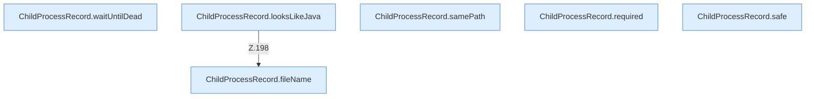

[[00 Start]] › [[Child-Prozess]] › [[Prozess-Bausteine]] › [[ChildProcessRecord]] › [[ChildProcessRecord.Teil2]]

# ChildProcessRecord.Teil2

```mermaid
flowchart TD
  n1["ChildProcessRecord.waitUntilDead"]:::internal-link
  n2["ChildProcessRecord.looksLikeJava"]:::internal-link
  n3["ChildProcessRecord.samePath"]:::internal-link
  n4["ChildProcessRecord.fileName"]:::internal-link
  n5["ChildProcessRecord.required"]:::internal-link
  n6["ChildProcessRecord.safe"]:::internal-link
  n2 -->|"Z.198"| n4
  classDef internal-link fill:#ddeeff,stroke:#4488cc
  classDef befund fill:#f88
```

