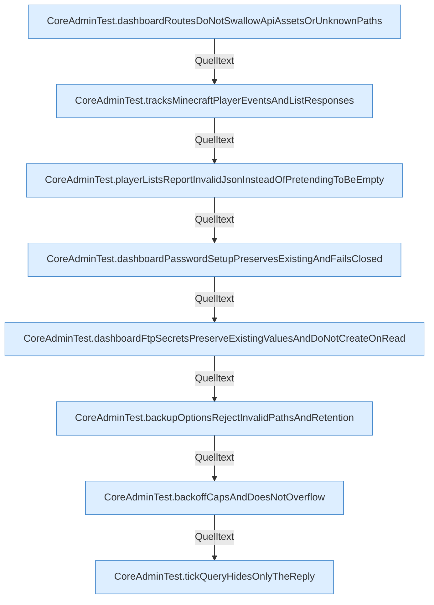

[[00 Start]] › [[Tests]] › [[CoreAdminTest]] › [[CoreAdminTest.Teil1]]

# CoreAdminTest.Teil1

```mermaid
flowchart TD
  n1["CoreAdminTest.dashboardRoutesDoNotSwallowApiAssetsOrUnknownPaths"]:::internal-link
  n2["CoreAdminTest.tracksMinecraftPlayerEventsAndListResponses"]:::internal-link
  n3["CoreAdminTest.playerListsReportInvalidJsonInsteadOfPretendingToBeEmpty"]:::internal-link
  n4["CoreAdminTest.dashboardPasswordSetupPreservesExistingAndFailsClosed"]:::internal-link
  n5["CoreAdminTest.dashboardFtpSecretsPreserveExistingValuesAndDoNotCreateOnRead"]:::internal-link
  n6["CoreAdminTest.backupOptionsRejectInvalidPathsAndRetention"]:::internal-link
  n7["CoreAdminTest.backoffCapsAndDoesNotOverflow"]:::internal-link
  n8["CoreAdminTest.tickQueryHidesOnlyTheReply"]:::internal-link
  n1 -->|"Quelltext"| n2
  n2 -->|"Quelltext"| n3
  n3 -->|"Quelltext"| n4
  n4 -->|"Quelltext"| n5
  n5 -->|"Quelltext"| n6
  n6 -->|"Quelltext"| n7
  n7 -->|"Quelltext"| n8
  classDef internal-link fill:#ddeeff,stroke:#4488cc
  classDef befund fill:#f88
```

