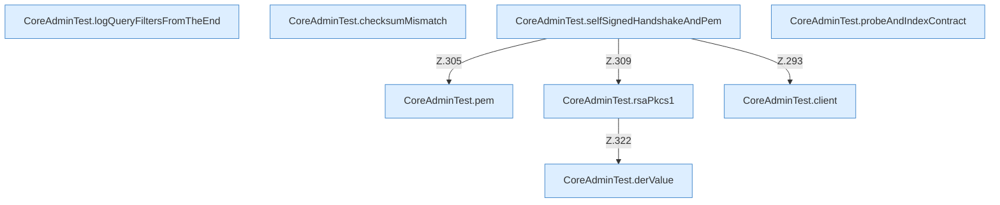

[[00 Start]] › [[Tests]] › [[CoreAdminTest]] › [[CoreAdminTest.Teil3]]

# CoreAdminTest.Teil3

```mermaid
flowchart TD
  n1["CoreAdminTest.logQueryFiltersFromTheEnd"]:::internal-link
  n2["CoreAdminTest.checksumMismatch"]:::internal-link
  n3["CoreAdminTest.selfSignedHandshakeAndPem"]:::internal-link
  n4["CoreAdminTest.pem"]:::internal-link
  n5["CoreAdminTest.rsaPkcs1"]:::internal-link
  n6["CoreAdminTest.derValue"]:::internal-link
  n7["CoreAdminTest.probeAndIndexContract"]:::internal-link
  n8["CoreAdminTest.client"]:::internal-link
  n3 -->|"Z.293"| n8
  n3 -->|"Z.305"| n4
  n3 -->|"Z.309"| n5
  n5 -->|"Z.322"| n6
  classDef internal-link fill:#ddeeff,stroke:#4488cc
  classDef befund fill:#f88
```

