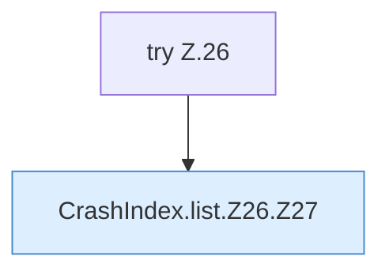

[[00 Start]] › [[Dashboard-HTTP]] › [[HTTP-Klassen]] › [[CrashIndex]] › [[CrashIndex.list]] › [[CrashIndex.list.Z26]]

# CrashIndex.list.Z26

```mermaid
flowchart TD
  n1["try Z.26"]
  n2["CrashIndex.list.Z26.Z27"]:::internal-link
  n1 --> n2
  classDef internal-link fill:#ddeeff,stroke:#4488cc
  classDef befund fill:#f88
```

- Fortsetzung von `CrashIndex.list`, Quellreihenfolge.
