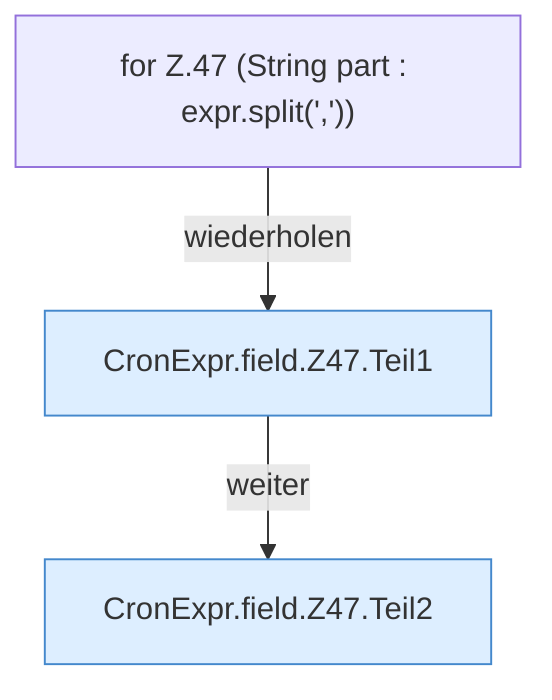

[[00 Start]] › [[Zeitplaene]] › [[Plan-Klassen]] › [[CronExpr]] › [[CronExpr.field]] › [[CronExpr.field.Z47]]

# CronExpr.field.Z47

```mermaid
flowchart TD
  n1["for Z.47 (String part : expr.split(','))"]
  n2["CronExpr.field.Z47.Teil1"]:::internal-link
  n3["CronExpr.field.Z47.Teil2"]:::internal-link
  n2 -->|"weiter"| n3
  n1 -->|"wiederholen"| n2
  classDef internal-link fill:#ddeeff,stroke:#4488cc
  classDef befund fill:#f88
```

- Fortsetzung von `CronExpr.field`, Quellreihenfolge.
