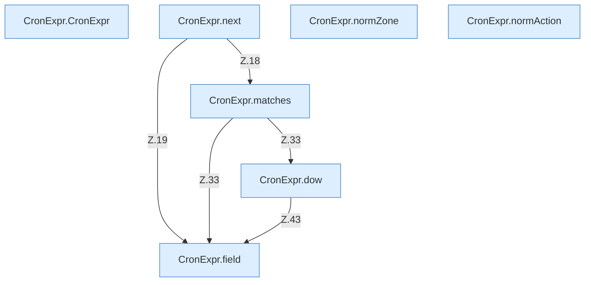

[[00 Start]] › [[Zeitplaene]] › [[Plan-Klassen]] › [[CronExpr]]

# CronExpr

```mermaid
flowchart TD
  n1["CronExpr.CronExpr"]:::internal-link
  n2["CronExpr.next"]:::internal-link
  n3["CronExpr.matches"]:::internal-link
  n4["CronExpr.dow"]:::internal-link
  n5["CronExpr.field"]:::internal-link
  n6["CronExpr.normZone"]:::internal-link
  n7["CronExpr.normAction"]:::internal-link
  n2 -->|"Z.18"| n3
  n2 -->|"Z.19"| n5
  n3 -->|"Z.33"| n5
  n3 -->|"Z.33"| n4
  n4 -->|"Z.43"| n5
  classDef internal-link fill:#ddeeff,stroke:#4488cc
  classDef befund fill:#f88
```

