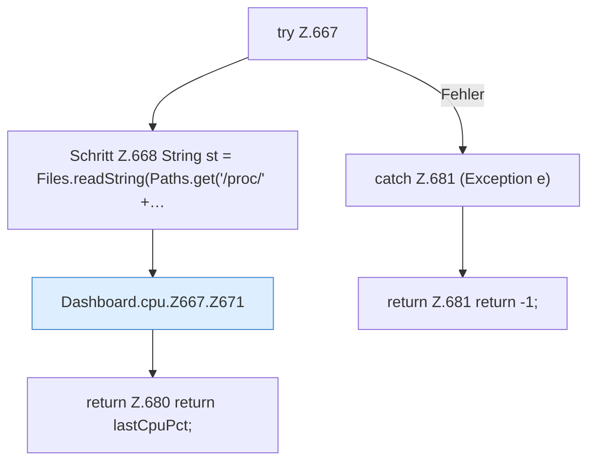

[[00 Start]] › [[Dashboard-HTTP]] › [[API-Status]] › [[Dashboard.cpu]] › [[Dashboard.cpu.Z667]]

# Dashboard.cpu.Z667

```mermaid
flowchart TD
  n1["try Z.667"]
  n2["Schritt Z.668 String st = Files.readString(Paths.get('/proc/' +…"]
  n3["Dashboard.cpu.Z667.Z671"]:::internal-link
  n4["return Z.680 return lastCpuPct;"]
  n5["catch Z.681 (Exception e)"]
  n6["return Z.681 return -1;"]
  n2 --> n3
  n3 --> n4
  n1 --> n2
  n1 -->|"Fehler"| n5
  n5 --> n6
  classDef internal-link fill:#ddeeff,stroke:#4488cc
  classDef befund fill:#f88
```

- Fortsetzung von `Dashboard.cpu`, Quellreihenfolge.
