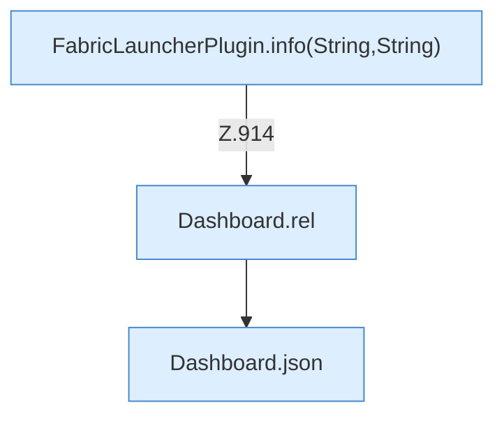

[[00 Start]] › [[Dashboard-HTTP]] › [[API-Dateien]] › [[Dashboard.fsDelete]] › [[Dashboard.fsDelete.Teil2]]

# Dashboard.fsDelete.Teil2

```mermaid
flowchart TD
  n1["FabricLauncherPlugin.info(String,String)"]:::internal-link
  n2["Dashboard.rel"]:::internal-link
  n3["Dashboard.json"]:::internal-link
  n1 -->|"Z.914"| n2
  n2 --> n3
  classDef internal-link fill:#ddeeff,stroke:#4488cc
  classDef befund fill:#f88
```

- Fortsetzung von `Dashboard.fsDelete`, Quellreihenfolge.
