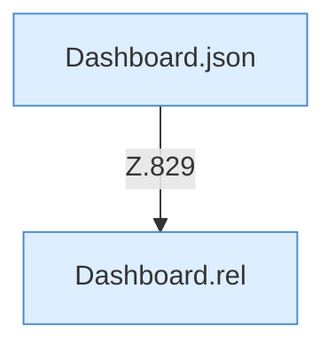

[[00 Start]] › [[Dashboard-HTTP]] › [[API-Dateien]] › [[Dashboard.fsList]] › [[Dashboard.fsList.Teil2]]

# Dashboard.fsList.Teil2

```mermaid
flowchart TD
  n1["Dashboard.json"]:::internal-link
  n2["Dashboard.rel"]:::internal-link
  n1 -->|"Z.829"| n2
  classDef internal-link fill:#ddeeff,stroke:#4488cc
  classDef befund fill:#f88
```

- Fortsetzung von `Dashboard.fsList`, Quellreihenfolge.
