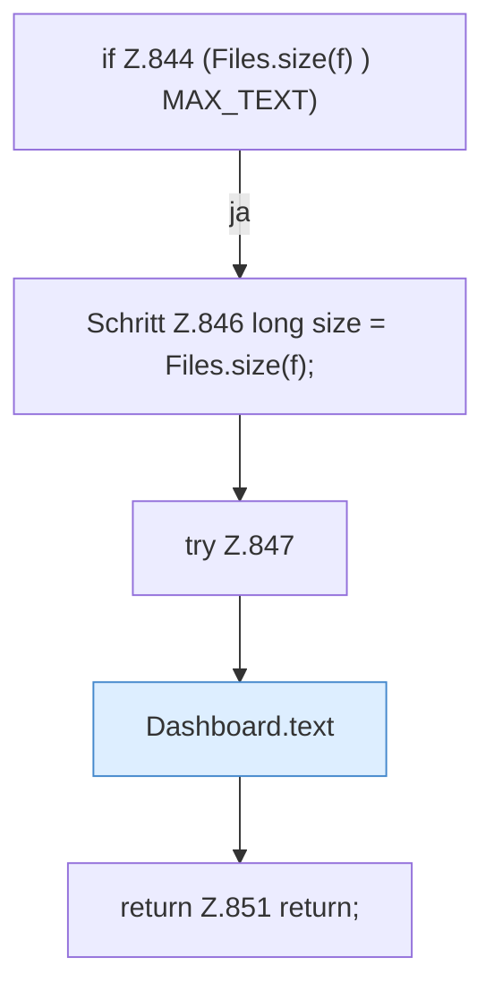

[[00 Start]] › [[Dashboard-HTTP]] › [[API-Dateien]] › [[Dashboard.fsRead]] › [[Dashboard.fsRead.Z844]]

# Dashboard.fsRead.Z844

```mermaid
flowchart TD
  n1["if Z.844 (Files.size(f) ) MAX_TEXT)"]
  n2["Schritt Z.846 long size = Files.size(f);"]
  n3["try Z.847"]
  n4["Dashboard.text"]:::internal-link
  n5["return Z.851 return;"]
  n3 --> n4
  n2 --> n3
  n4 --> n5
  n1 -->|"ja"| n2
  classDef internal-link fill:#ddeeff,stroke:#4488cc
  classDef befund fill:#f88
```

- Fortsetzung von `Dashboard.fsRead`, Quellreihenfolge.
