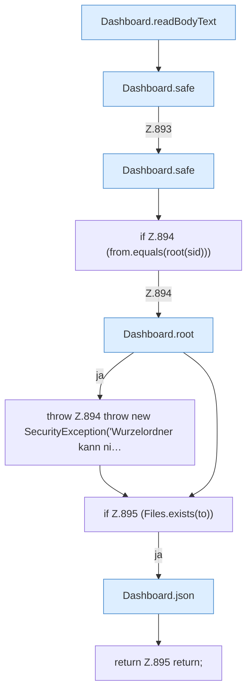

[[00 Start]] › [[Dashboard-HTTP]] › [[API-Dateien]] › [[Dashboard.fsRename]] › [[Dashboard.fsRename.Teil1]]

# Dashboard.fsRename.Teil1

```mermaid
flowchart TD
  n1["Dashboard.readBodyText"]:::internal-link
  n2["Dashboard.safe"]:::internal-link
  n3["Dashboard.safe"]:::internal-link
  n4["if Z.894 (from.equals(root(sid)))"]
  n5["Dashboard.root"]:::internal-link
  n6["throw Z.894 throw new SecurityException('Wurzelordner kann ni…"]
  n7["if Z.895 (Files.exists(to))"]
  n8["Dashboard.json"]:::internal-link
  n9["return Z.895 return;"]
  n2 -->|"Z.893"| n3
  n1 --> n2
  n4 -->|"Z.894"| n5
  n5 -->|"ja"| n6
  n3 --> n4
  n8 --> n9
  n7 -->|"ja"| n8
  n6 --> n7
  n5 --> n7
  classDef internal-link fill:#ddeeff,stroke:#4488cc
  classDef befund fill:#f88
```

- Fortsetzung von `Dashboard.fsRename`, Quellreihenfolge.
