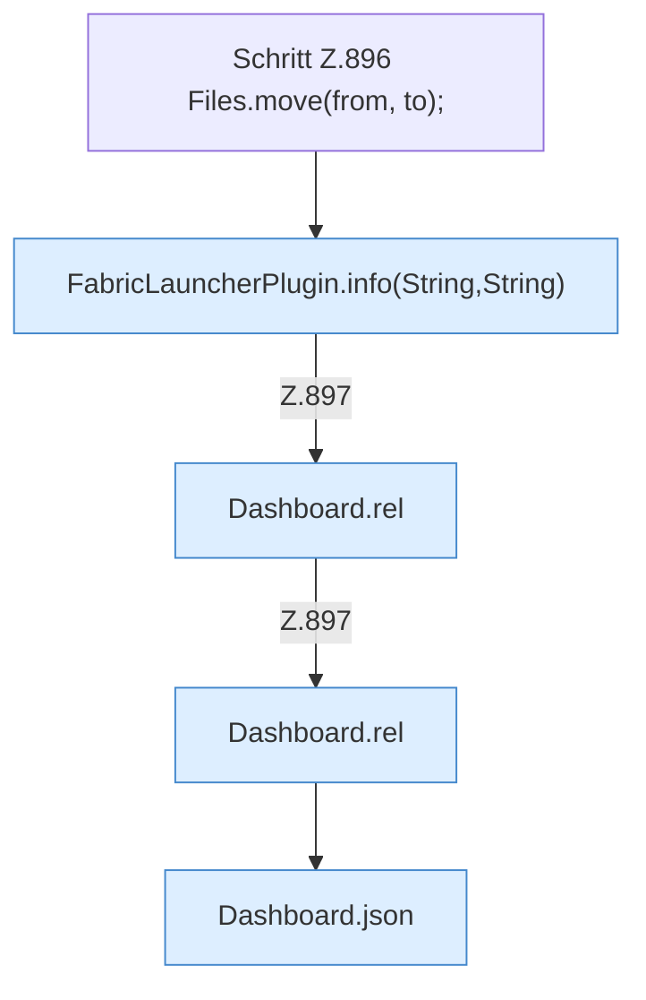

[[00 Start]] › [[Dashboard-HTTP]] › [[API-Dateien]] › [[Dashboard.fsRename]] › [[Dashboard.fsRename.Teil2]]

# Dashboard.fsRename.Teil2

```mermaid
flowchart TD
  n1["Schritt Z.896 Files.move(from, to);"]
  n2["FabricLauncherPlugin.info(String,String)"]:::internal-link
  n3["Dashboard.rel"]:::internal-link
  n4["Dashboard.rel"]:::internal-link
  n5["Dashboard.json"]:::internal-link
  n2 -->|"Z.897"| n3
  n3 -->|"Z.897"| n4
  n1 --> n2
  n4 --> n5
  classDef internal-link fill:#ddeeff,stroke:#4488cc
  classDef befund fill:#f88
```

- Fortsetzung von `Dashboard.fsRename`, Quellreihenfolge.
