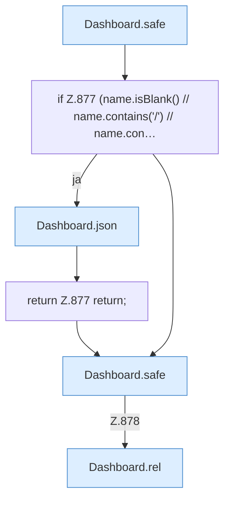

[[00 Start]] › [[Dashboard-HTTP]] › [[API-Dateien]] › [[Dashboard.fsUpload]] › [[Dashboard.fsUpload.Teil1]]

# Dashboard.fsUpload.Teil1

```mermaid
flowchart TD
  n1["Dashboard.safe"]:::internal-link
  n2["if Z.877 (name.isBlank() // name.contains('/') // name.con…"]
  n3["Dashboard.json"]:::internal-link
  n4["return Z.877 return;"]
  n5["Dashboard.safe"]:::internal-link
  n6["Dashboard.rel"]:::internal-link
  n3 --> n4
  n2 -->|"ja"| n3
  n1 --> n2
  n5 -->|"Z.878"| n6
  n4 --> n5
  n2 --> n5
  classDef internal-link fill:#ddeeff,stroke:#4488cc
  classDef befund fill:#f88
```

- Fortsetzung von `Dashboard.fsUpload`, Quellreihenfolge.
