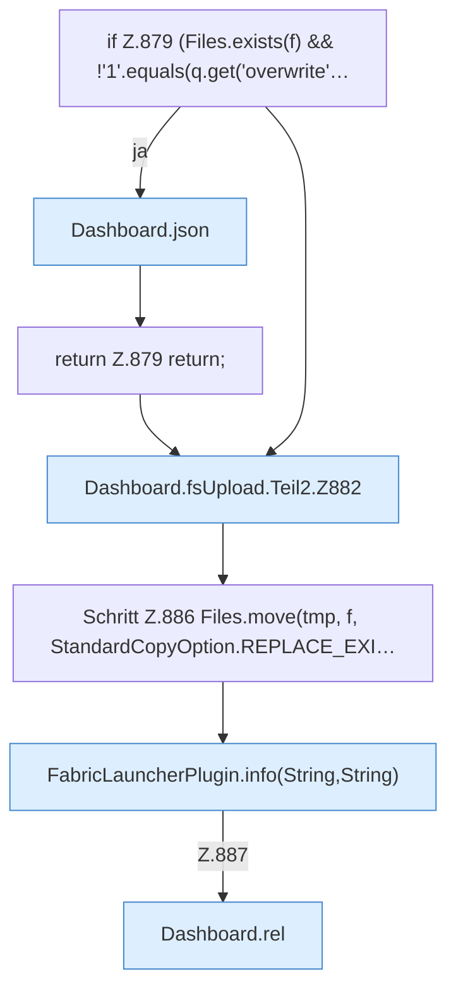

[[00 Start]] › [[Dashboard-HTTP]] › [[API-Dateien]] › [[Dashboard.fsUpload]] › [[Dashboard.fsUpload.Teil2]]

# Dashboard.fsUpload.Teil2

```mermaid
flowchart TD
  n1["if Z.879 (Files.exists(f) && !'1'.equals(q.get('overwrite'…"]
  n2["Dashboard.json"]:::internal-link
  n3["return Z.879 return;"]
  n4["Dashboard.fsUpload.Teil2.Z882"]:::internal-link
  n5["Schritt Z.886 Files.move(tmp, f, StandardCopyOption.REPLACE_EXI…"]
  n6["FabricLauncherPlugin.info(String,String)"]:::internal-link
  n7["Dashboard.rel"]:::internal-link
  n2 --> n3
  n1 -->|"ja"| n2
  n3 --> n4
  n1 --> n4
  n4 --> n5
  n6 -->|"Z.887"| n7
  n5 --> n6
  classDef internal-link fill:#ddeeff,stroke:#4488cc
  classDef befund fill:#f88
```

- Fortsetzung von `Dashboard.fsUpload`, Quellreihenfolge.
