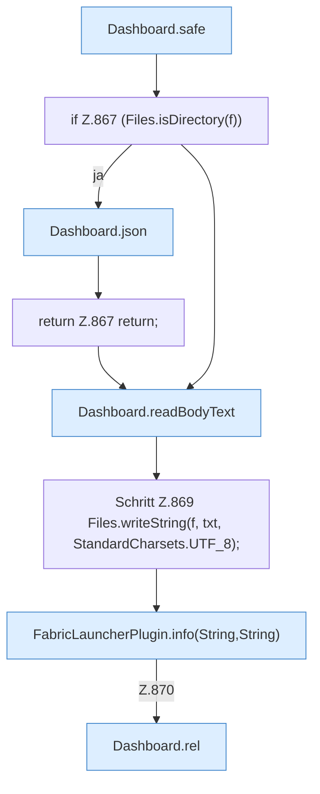

[[00 Start]] › [[Dashboard-HTTP]] › [[API-Dateien]] › [[Dashboard.fsWrite]] › [[Dashboard.fsWrite.Teil1]]

# Dashboard.fsWrite.Teil1

```mermaid
flowchart TD
  n1["Dashboard.safe"]:::internal-link
  n2["if Z.867 (Files.isDirectory(f))"]
  n3["Dashboard.json"]:::internal-link
  n4["return Z.867 return;"]
  n5["Dashboard.readBodyText"]:::internal-link
  n6["Schritt Z.869 Files.writeString(f, txt, StandardCharsets.UTF_8);"]
  n7["FabricLauncherPlugin.info(String,String)"]:::internal-link
  n8["Dashboard.rel"]:::internal-link
  n3 --> n4
  n2 -->|"ja"| n3
  n1 --> n2
  n4 --> n5
  n2 --> n5
  n5 --> n6
  n7 -->|"Z.870"| n8
  n6 --> n7
  classDef internal-link fill:#ddeeff,stroke:#4488cc
  classDef befund fill:#f88
```

- Fortsetzung von `Dashboard.fsWrite`, Quellreihenfolge.
