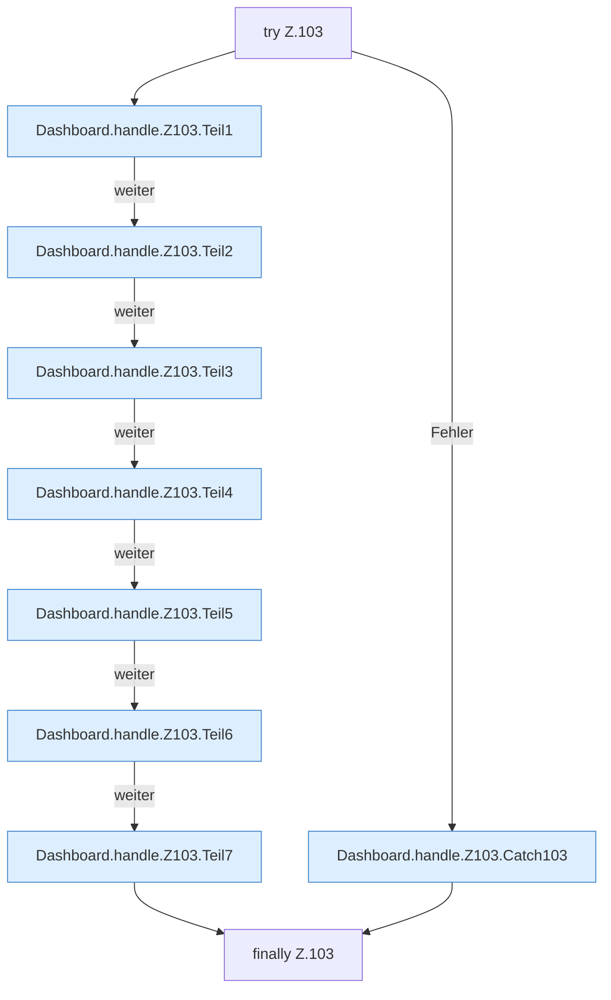

[[00 Start]] › [[Dashboard-HTTP]] › [[HTTP-Routing]] › [[Dashboard.handle]] › [[Dashboard.handle.Z103]]

# Dashboard.handle.Z103

```mermaid
flowchart TD
  n1["try Z.103"]
  n2["Dashboard.handle.Z103.Teil1"]:::internal-link
  n3["Dashboard.handle.Z103.Teil2"]:::internal-link
  n4["Dashboard.handle.Z103.Teil3"]:::internal-link
  n5["Dashboard.handle.Z103.Teil4"]:::internal-link
  n6["Dashboard.handle.Z103.Teil5"]:::internal-link
  n7["Dashboard.handle.Z103.Teil6"]:::internal-link
  n8["Dashboard.handle.Z103.Teil7"]:::internal-link
  n9["Dashboard.handle.Z103.Catch103"]:::internal-link
  n10["finally Z.103"]
  n2 -->|"weiter"| n3
  n3 -->|"weiter"| n4
  n4 -->|"weiter"| n5
  n5 -->|"weiter"| n6
  n6 -->|"weiter"| n7
  n7 -->|"weiter"| n8
  n1 --> n2
  n1 -->|"Fehler"| n9
  n8 --> n10
  n9 --> n10
  classDef internal-link fill:#ddeeff,stroke:#4488cc
  classDef befund fill:#f88
```

- Fortsetzung von `Dashboard.handle`, Quellreihenfolge.
