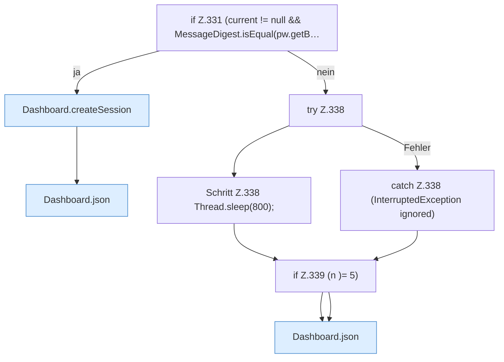

[[00 Start]] › [[Dashboard-HTTP]] › [[HTTP-Auth]] › [[Dashboard.login]] › [[Dashboard.login.Z331]]

# Dashboard.login.Z331

```mermaid
flowchart TD
  n1["if Z.331 (current != null && MessageDigest.isEqual(pw.getB…"]
  n2["Dashboard.createSession"]:::internal-link
  n3["Dashboard.json"]:::internal-link
  n4["try Z.338"]
  n5["Schritt Z.338 Thread.sleep(800);"]
  n6["catch Z.338 (InterruptedException ignored)"]
  n7["if Z.339 (n )= 5)"]
  n8["Dashboard.json"]:::internal-link
  n2 --> n3
  n4 --> n5
  n4 -->|"Fehler"| n6
  n5 --> n7
  n6 --> n7
  n7 --> n8
  n7 --> n8
  n1 -->|"ja"| n2
  n1 -->|"nein"| n4
  classDef internal-link fill:#ddeeff,stroke:#4488cc
  classDef befund fill:#f88
```

- Fortsetzung von `Dashboard.login`, Quellreihenfolge.
