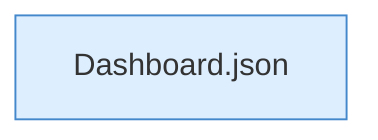

[[00 Start]] › [[Dashboard-HTTP]] › [[API-Setup]] › [[Dashboard.saveProps]] › [[Dashboard.saveProps.Teil2]]

# Dashboard.saveProps.Teil2

```mermaid
flowchart TD
  n1["Dashboard.json"]:::internal-link
  classDef internal-link fill:#ddeeff,stroke:#4488cc
  classDef befund fill:#f88
```

- Fortsetzung von `Dashboard.saveProps`, Quellreihenfolge.
