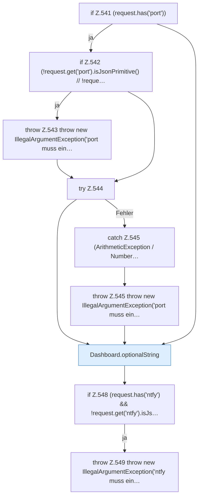

[[00 Start]] › [[Dashboard-HTTP]] › [[API-Setup]] › [[Dashboard.setup]] › [[Dashboard.setup.Teil2]]

# Dashboard.setup.Teil2

```mermaid
flowchart TD
  n1["if Z.541 (request.has('port'))"]
  n2["if Z.542 (!request.get('port').isJsonPrimitive() // !reque…"]
  n3["throw Z.543 throw new IllegalArgumentException('port muss ein…"]
  n4["try Z.544"]
  n5["catch Z.545 (ArithmeticException / Number…"]
  n6["throw Z.545 throw new IllegalArgumentException('port muss ein…"]
  n7["Dashboard.optionalString"]:::internal-link
  n8["if Z.548 (request.has('ntfy') && !request.get('ntfy').isJs…"]
  n9["throw Z.549 throw new IllegalArgumentException('ntfy muss ein…"]
  n2 -->|"ja"| n3
  n4 -->|"Fehler"| n5
  n5 --> n6
  n3 --> n4
  n2 --> n4
  n1 -->|"ja"| n2
  n4 --> n7
  n6 --> n7
  n1 --> n7
  n8 -->|"ja"| n9
  n7 --> n8
  classDef internal-link fill:#ddeeff,stroke:#4488cc
  classDef befund fill:#f88
```

- Fortsetzung von `Dashboard.setup`, Quellreihenfolge.
