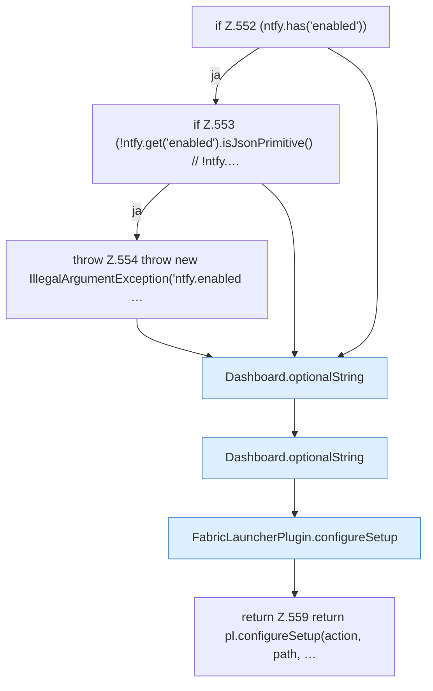

[[00 Start]] › [[Dashboard-HTTP]] › [[API-Setup]] › [[Dashboard.setup]] › [[Dashboard.setup.Teil3]]

# Dashboard.setup.Teil3

```mermaid
flowchart TD
  n1["if Z.552 (ntfy.has('enabled'))"]
  n2["if Z.553 (!ntfy.get('enabled').isJsonPrimitive() // !ntfy.…"]
  n3["throw Z.554 throw new IllegalArgumentException('ntfy.enabled …"]
  n4["Dashboard.optionalString"]:::internal-link
  n5["Dashboard.optionalString"]:::internal-link
  n6["FabricLauncherPlugin.configureSetup"]:::internal-link
  n7["return Z.559 return pl.configureSetup(action, path, …"]
  n2 -->|"ja"| n3
  n1 -->|"ja"| n2
  n3 --> n4
  n2 --> n4
  n1 --> n4
  n4 --> n5
  n6 --> n7
  n5 --> n6
  classDef internal-link fill:#ddeeff,stroke:#4488cc
  classDef befund fill:#f88
```

- Fortsetzung von `Dashboard.setup`, Quellreihenfolge.
