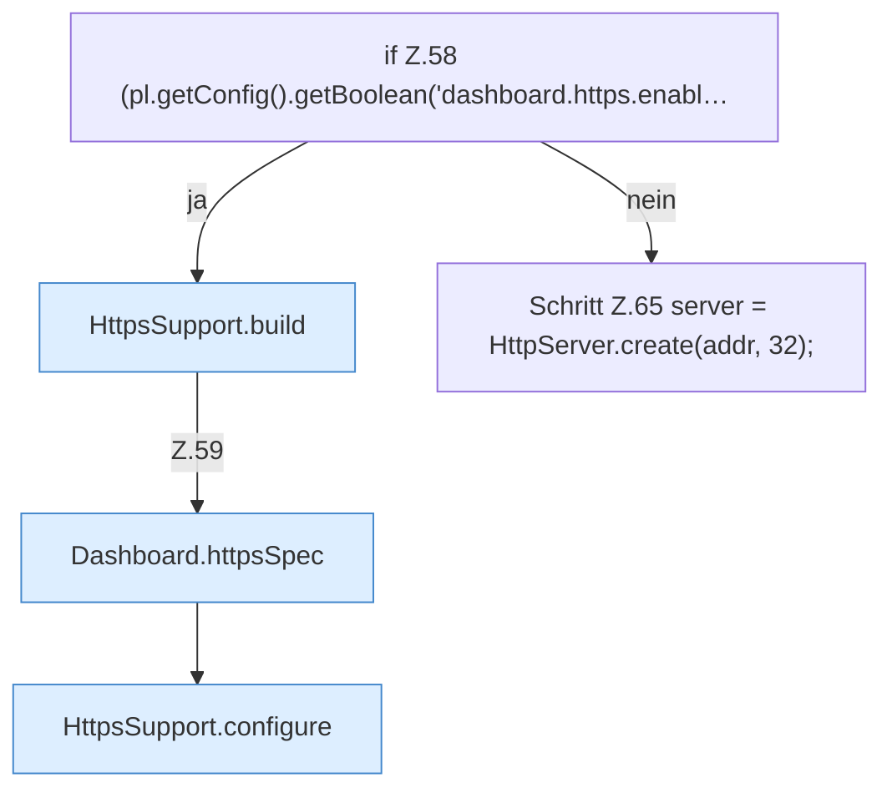

[[00 Start]] › [[Dashboard-HTTP]] › [[HTTP-Start]] › [[Dashboard.start]] › [[Dashboard.start.Teil2.Z58]]

# Dashboard.start.Teil2.Z58

```mermaid
flowchart TD
  n1["if Z.58 (pl.getConfig().getBoolean('dashboard.https.enabl…"]
  n2["HttpsSupport.build"]:::internal-link
  n3["Dashboard.httpsSpec"]:::internal-link
  n4["HttpsSupport.configure"]:::internal-link
  n5["Schritt Z.65 server = HttpServer.create(addr, 32);"]
  n2 -->|"Z.59"| n3
  n3 --> n4
  n1 -->|"ja"| n2
  n1 -->|"nein"| n5
  classDef internal-link fill:#ddeeff,stroke:#4488cc
  classDef befund fill:#f88
```

- Fortsetzung von `Dashboard.start.Teil2`, Quellreihenfolge.
