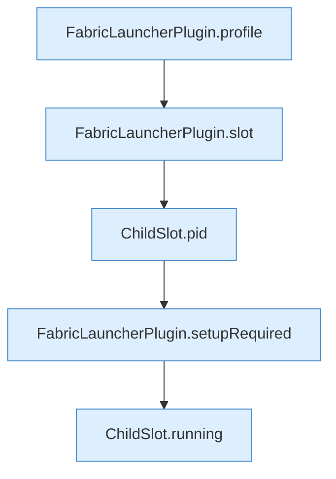

[[00 Start]] › [[Dashboard-HTTP]] › [[API-Status]] › [[Dashboard.status]] › [[Dashboard.status.Teil1]]

# Dashboard.status.Teil1

```mermaid
flowchart TD
  n1["FabricLauncherPlugin.profile"]:::internal-link
  n2["FabricLauncherPlugin.slot"]:::internal-link
  n3["ChildSlot.pid"]:::internal-link
  n4["FabricLauncherPlugin.setupRequired"]:::internal-link
  n5["ChildSlot.running"]:::internal-link
  n1 --> n2
  n2 --> n3
  n3 --> n4
  n4 --> n5
  classDef internal-link fill:#ddeeff,stroke:#4488cc
  classDef befund fill:#f88
```

- Fortsetzung von `Dashboard.status`, Quellreihenfolge.
