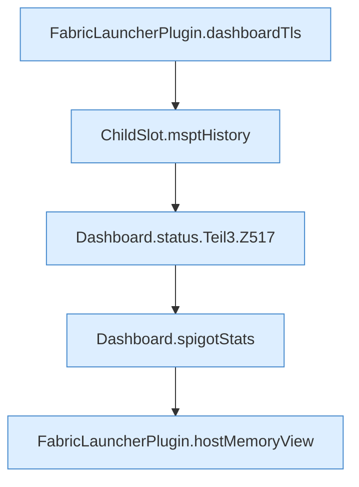

[[00 Start]] › [[Dashboard-HTTP]] › [[API-Status]] › [[Dashboard.status]] › [[Dashboard.status.Teil3]]

# Dashboard.status.Teil3

```mermaid
flowchart TD
  n1["FabricLauncherPlugin.dashboardTls"]:::internal-link
  n2["ChildSlot.msptHistory"]:::internal-link
  n3["Dashboard.status.Teil3.Z517"]:::internal-link
  n4["Dashboard.spigotStats"]:::internal-link
  n5["FabricLauncherPlugin.hostMemoryView"]:::internal-link
  n1 --> n2
  n2 --> n3
  n3 --> n4
  n4 --> n5
  classDef internal-link fill:#ddeeff,stroke:#4488cc
  classDef befund fill:#f88
```

- Fortsetzung von `Dashboard.status`, Quellreihenfolge.
