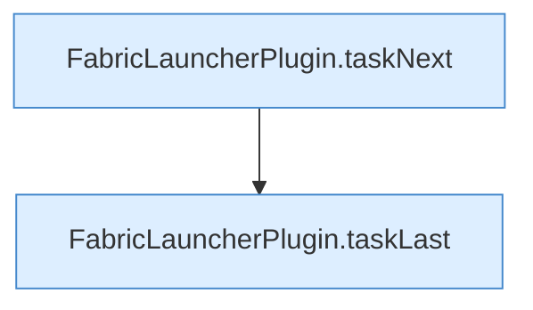

[[00 Start]] › [[Dashboard-HTTP]] › [[API-Zeit]] › [[Dashboard.taskJson]] › [[Dashboard.taskJson.Teil1]]

# Dashboard.taskJson.Teil1

```mermaid
flowchart TD
  n1["FabricLauncherPlugin.taskNext"]:::internal-link
  n2["FabricLauncherPlugin.taskLast"]:::internal-link
  n1 --> n2
  classDef internal-link fill:#ddeeff,stroke:#4488cc
  classDef befund fill:#f88
```

- Fortsetzung von `Dashboard.taskJson`, Quellreihenfolge.
