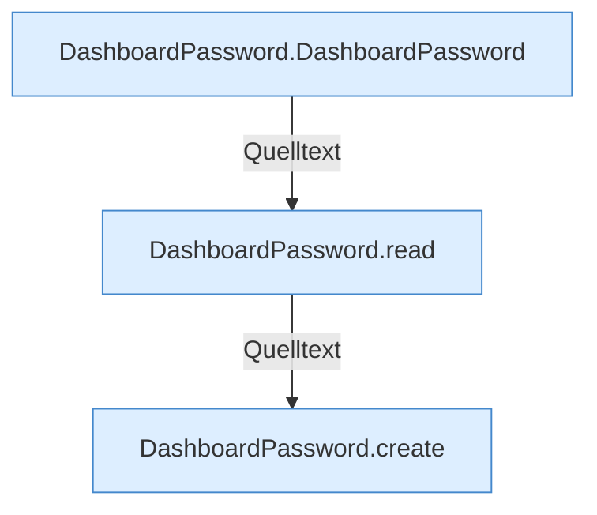

[[00 Start]] › [[Dashboard-HTTP]] › [[HTTP-Klassen]] › [[DashboardPassword]]

# DashboardPassword

```mermaid
flowchart TD
  n1["DashboardPassword.DashboardPassword"]:::internal-link
  n2["DashboardPassword.read"]:::internal-link
  n3["DashboardPassword.create"]:::internal-link
  n1 -->|"Quelltext"| n2
  n2 -->|"Quelltext"| n3
  classDef internal-link fill:#ddeeff,stroke:#4488cc
  classDef befund fill:#f88
```

