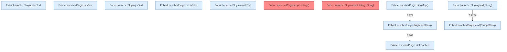

[[00 Start]] › [[Plugin-Kern]] › [[Diagnose]]

# Diagnose

```mermaid
flowchart TD
  n1["FabricLauncherPlugin.planText"]:::internal-link
  n2["FabricLauncherPlugin.jarView"]:::internal-link
  n3["FabricLauncherPlugin.jarText"]:::internal-link
  n4["FabricLauncherPlugin.crashFiles"]:::internal-link
  n5["FabricLauncherPlugin.crashText"]:::internal-link
  n6["FabricLauncherPlugin.msptHistory()"]:::internal-link
  n7["FabricLauncherPlugin.msptHistory(String)"]:::internal-link
  n8["FabricLauncherPlugin.diskCached"]:::internal-link
  n9["FabricLauncherPlugin.diagMap()"]:::internal-link
  n10["FabricLauncherPlugin.diagMap(String)"]:::internal-link
  n11["FabricLauncherPlugin.jcmd(String)"]:::internal-link
  n12["FabricLauncherPlugin.jcmd(String,String)"]:::internal-link
  n9 -->|"Z.879"| n10
  n10 -->|"Z.903"| n8
  n11 -->|"Z.1266"| n12
  classDef internal-link fill:#ddeeff,stroke:#4488cc
  classDef befund fill:#f88
  style n6 fill:#f88,stroke:#900
  style n7 fill:#f88,stroke:#900
```

