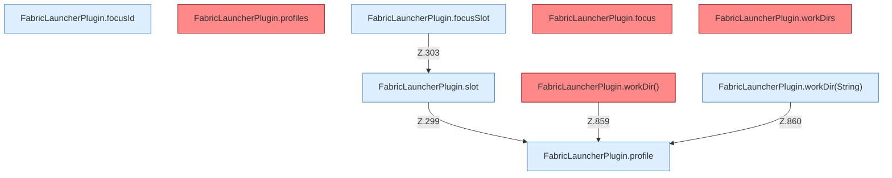

[[00 Start]] › [[Plugin-Kern]] › [[Fokus]]

# Fokus

```mermaid
flowchart TD
  n1["FabricLauncherPlugin.focusId"]:::internal-link
  n2["FabricLauncherPlugin.profiles"]:::internal-link
  n3["FabricLauncherPlugin.profile"]:::internal-link
  n4["FabricLauncherPlugin.slot"]:::internal-link
  n5["FabricLauncherPlugin.focusSlot"]:::internal-link
  n6["FabricLauncherPlugin.focus"]:::internal-link
  n7["FabricLauncherPlugin.workDir()"]:::internal-link
  n8["FabricLauncherPlugin.workDir(String)"]:::internal-link
  n9["FabricLauncherPlugin.workDirs"]:::internal-link
  n4 -->|"Z.299"| n3
  n5 -->|"Z.303"| n4
  n7 -->|"Z.859"| n3
  n8 -->|"Z.860"| n3
  classDef internal-link fill:#ddeeff,stroke:#4488cc
  classDef befund fill:#f88
  style n2 fill:#f88,stroke:#900
  style n6 fill:#f88,stroke:#900
  style n7 fill:#f88,stroke:#900
  style n9 fill:#f88,stroke:#900
```

