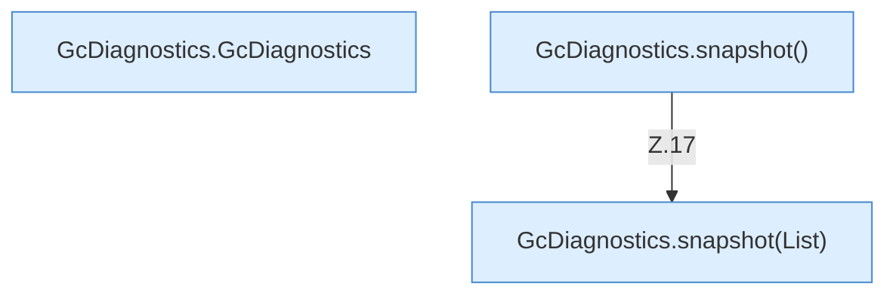

[[00 Start]] › [[Host-Betrieb]] › [[Speicher-Messung]] › [[GcDiagnostics]]

# GcDiagnostics

```mermaid
flowchart TD
  n1["GcDiagnostics.GcDiagnostics"]:::internal-link
  n2["GcDiagnostics.snapshot()"]:::internal-link
  n3["GcDiagnostics.snapshot(List)"]:::internal-link
  n2 -->|"Z.17"| n3
  classDef internal-link fill:#ddeeff,stroke:#4488cc
  classDef befund fill:#f88
```

