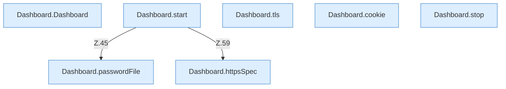

[[00 Start]] › [[Dashboard-HTTP]] › [[HTTP-Start]]

# HTTP-Start

```mermaid
flowchart TD
  n1["Dashboard.Dashboard"]:::internal-link
  n2["Dashboard.start"]:::internal-link
  n3["Dashboard.tls"]:::internal-link
  n4["Dashboard.httpsSpec"]:::internal-link
  n5["Dashboard.cookie"]:::internal-link
  n6["Dashboard.stop"]:::internal-link
  n7["Dashboard.passwordFile"]:::internal-link
  n2 -->|"Z.45"| n7
  n2 -->|"Z.59"| n4
  classDef internal-link fill:#ddeeff,stroke:#4488cc
  classDef befund fill:#f88
```

