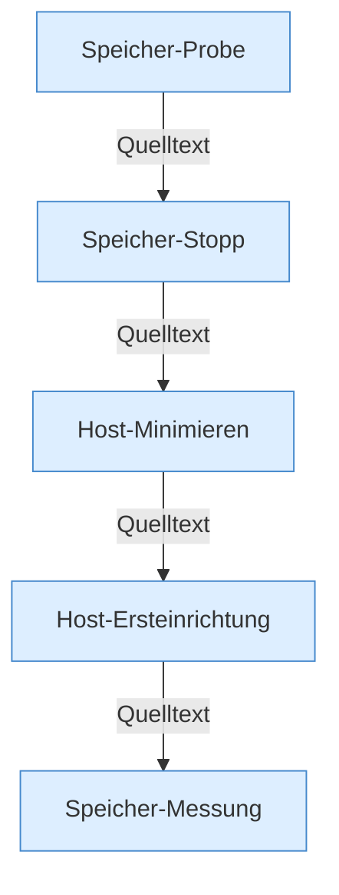

[[00 Start]] › [[Host-Betrieb]]

# Host-Betrieb

```mermaid
flowchart TD
  n1["Speicher-Probe"]:::internal-link
  n2["Speicher-Stopp"]:::internal-link
  n3["Host-Minimieren"]:::internal-link
  n4["Host-Ersteinrichtung"]:::internal-link
  n5["Speicher-Messung"]:::internal-link
  n1 -->|"Quelltext"| n2
  n2 -->|"Quelltext"| n3
  n3 -->|"Quelltext"| n4
  n4 -->|"Quelltext"| n5
  classDef internal-link fill:#ddeeff,stroke:#4488cc
  classDef befund fill:#f88
```

- cgroup-Speicher, Notstopp nur des Child, Host-Minimize, Ersteinrichtung.
