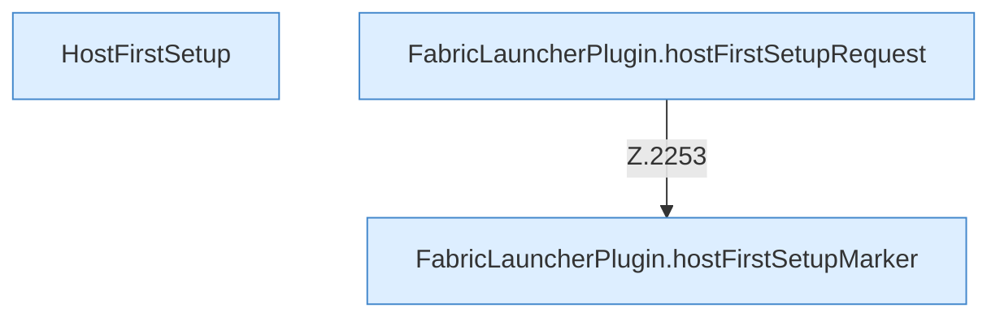

[[00 Start]] › [[Host-Betrieb]] › [[Host-Ersteinrichtung]]

# Host-Ersteinrichtung

```mermaid
flowchart TD
  n1["HostFirstSetup"]:::internal-link
  n2["FabricLauncherPlugin.hostFirstSetupMarker"]:::internal-link
  n3["FabricLauncherPlugin.hostFirstSetupRequest"]:::internal-link
  n3 -->|"Z.2253"| n2
  classDef internal-link fill:#ddeeff,stroke:#4488cc
  classDef befund fill:#f88
```

- Marker-Status steuert, ob der Host beim Start Welten umbaut.
