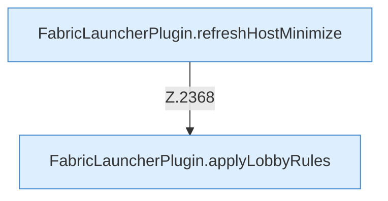

[[00 Start]] › [[Host-Betrieb]] › [[Host-Minimieren]] › [[Host-Minimieren.Teil2]]

# Host-Minimieren.Teil2

```mermaid
flowchart TD
  n1["FabricLauncherPlugin.refreshHostMinimize"]:::internal-link
  n2["FabricLauncherPlugin.applyLobbyRules"]:::internal-link
  n1 -->|"Z.2368"| n2
  classDef internal-link fill:#ddeeff,stroke:#4488cc
  classDef befund fill:#f88
```

