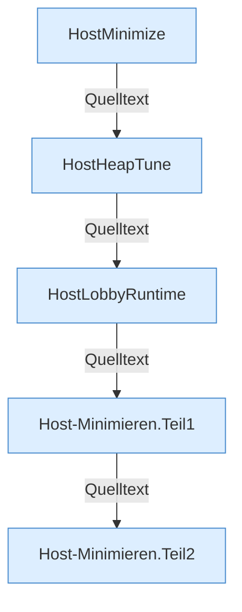

[[00 Start]] › [[Host-Betrieb]] › [[Host-Minimieren]]

# Host-Minimieren

```mermaid
flowchart TD
  n1["HostMinimize"]:::internal-link
  n2["HostHeapTune"]:::internal-link
  n3["HostLobbyRuntime"]:::internal-link
  n4["Host-Minimieren.Teil1"]:::internal-link
  n5["Host-Minimieren.Teil2"]:::internal-link
  n1 -->|"Quelltext"| n2
  n2 -->|"Quelltext"| n3
  n3 -->|"Quelltext"| n4
  n4 -->|"Quelltext"| n5
  classDef internal-link fill:#ddeeff,stroke:#4488cc
  classDef befund fill:#f88
```

