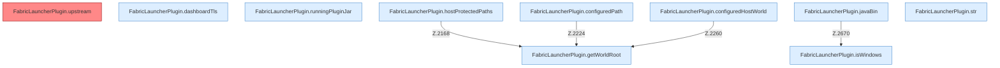

[[00 Start]] › [[Plugin-Kern]] › [[Host-Pfade]]

# Host-Pfade

```mermaid
flowchart TD
  n1["FabricLauncherPlugin.getWorldRoot"]:::internal-link
  n2["FabricLauncherPlugin.upstream"]:::internal-link
  n3["FabricLauncherPlugin.dashboardTls"]:::internal-link
  n4["FabricLauncherPlugin.runningPluginJar"]:::internal-link
  n5["FabricLauncherPlugin.hostProtectedPaths"]:::internal-link
  n6["FabricLauncherPlugin.configuredPath"]:::internal-link
  n7["FabricLauncherPlugin.configuredHostWorld"]:::internal-link
  n8["FabricLauncherPlugin.javaBin"]:::internal-link
  n9["FabricLauncherPlugin.str"]:::internal-link
  n10["FabricLauncherPlugin.isWindows"]:::internal-link
  n5 -->|"Z.2168"| n1
  n6 -->|"Z.2224"| n1
  n7 -->|"Z.2260"| n1
  n8 -->|"Z.2670"| n10
  classDef internal-link fill:#ddeeff,stroke:#4488cc
  classDef befund fill:#f88
  style n2 fill:#f88,stroke:#900
```

