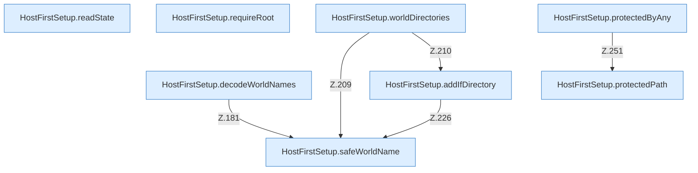

[[00 Start]] › [[Host-Betrieb]] › [[Host-Ersteinrichtung]] › [[HostFirstSetup]] › [[HostFirstSetup.Teil2]]

# HostFirstSetup.Teil2

```mermaid
flowchart TD
  n1["HostFirstSetup.decodeWorldNames"]:::internal-link
  n2["HostFirstSetup.readState"]:::internal-link
  n3["HostFirstSetup.requireRoot"]:::internal-link
  n4["HostFirstSetup.worldDirectories"]:::internal-link
  n5["HostFirstSetup.addIfDirectory"]:::internal-link
  n6["HostFirstSetup.safeWorldName"]:::internal-link
  n7["HostFirstSetup.protectedPath"]:::internal-link
  n8["HostFirstSetup.protectedByAny"]:::internal-link
  n1 -->|"Z.181"| n6
  n4 -->|"Z.209"| n6
  n4 -->|"Z.210"| n5
  n5 -->|"Z.226"| n6
  n8 -->|"Z.251"| n7
  classDef internal-link fill:#ddeeff,stroke:#4488cc
  classDef befund fill:#f88
```

