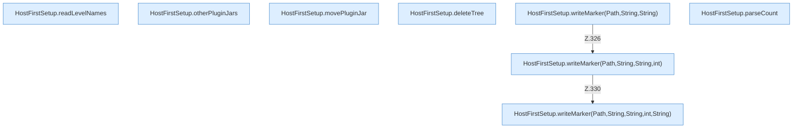

[[00 Start]] › [[Host-Betrieb]] › [[Host-Ersteinrichtung]] › [[HostFirstSetup]] › [[HostFirstSetup.Teil3]]

# HostFirstSetup.Teil3

```mermaid
flowchart TD
  n1["HostFirstSetup.readLevelNames"]:::internal-link
  n2["HostFirstSetup.otherPluginJars"]:::internal-link
  n3["HostFirstSetup.movePluginJar"]:::internal-link
  n4["HostFirstSetup.deleteTree"]:::internal-link
  n5["HostFirstSetup.writeMarker(Path,String,String)"]:::internal-link
  n6["HostFirstSetup.writeMarker(Path,String,String,int)"]:::internal-link
  n7["HostFirstSetup.writeMarker(Path,String,String,int,String)"]:::internal-link
  n8["HostFirstSetup.parseCount"]:::internal-link
  n5 -->|"Z.326"| n6
  n6 -->|"Z.330"| n7
  classDef internal-link fill:#ddeeff,stroke:#4488cc
  classDef befund fill:#f88
```

