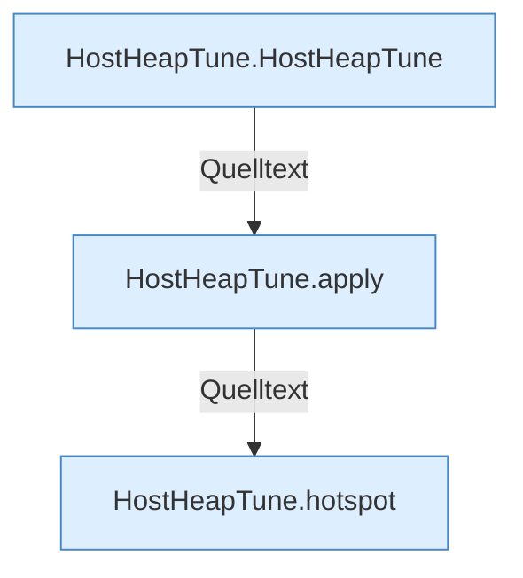

[[00 Start]] › [[Host-Betrieb]] › [[Host-Minimieren]] › [[HostHeapTune]]

# HostHeapTune

```mermaid
flowchart TD
  n1["HostHeapTune.HostHeapTune"]:::internal-link
  n2["HostHeapTune.apply"]:::internal-link
  n3["HostHeapTune.hotspot"]:::internal-link
  n1 -->|"Quelltext"| n2
  n2 -->|"Quelltext"| n3
  classDef internal-link fill:#ddeeff,stroke:#4488cc
  classDef befund fill:#f88
```

